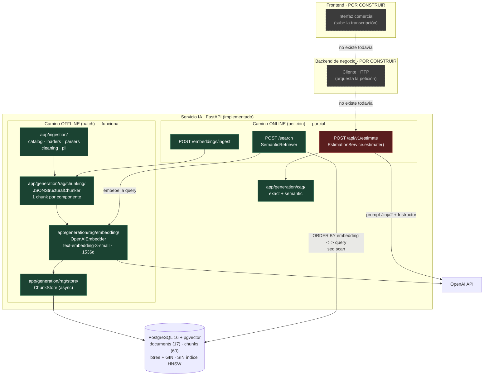
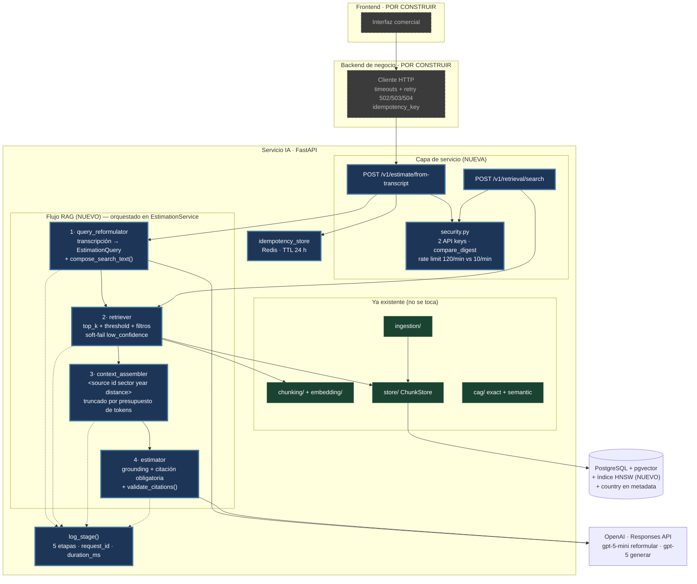

# Diagnóstico arquitectónico del sistema RAG actual

**Sesión 9 — Fundamentos de RAG · ejercicio pre-sesión**
Estado del servicio IA al cierre de la Sesión 08 · corpus de 17 presupuestos / 60 chunks en pgvector.

Todos los números de este documento salen de ejecuciones reales contra el sistema levantado con
`docker compose up -d`, no de estimaciones. El script que los reproduce es
[`estimator/scripts/s09_trace_prework.py`](estimator/scripts/s09_trace_prework.py).

---

## Sección 1 — Diagrama de la arquitectura actual



**Dónde acaba lo implementado.** En verde, lo que existe y funciona. En rojo, la caja que revela el
hueco: `POST /api/v1/estimate` **sí** genera una estimación, pero lo hace por la vía CAG (caché
exacta + caché semántica + prompt versionado). No consulta el corpus. Es decir: hay dos caminos
online que nunca se cruzan — uno recupera evidencia y no genera nada (`/search`), otro genera y no
recupera nada (`/api/v1/estimate`). Ese cruce es exactamente lo que falta.

Detalle de la capa de datos: la tabla `chunks` tiene índices btree (`document_id`, `chunk_type`) y
GIN (`metadata`), pero **ningún índice vectorial**. La S08 dejó deliberadamente el baseline de
sequential scan; el HNSW se construía en el directo.

---

## Sección 2 — Trace anotado de `02_ambiguous.txt`

Transcripción: reunión inicial con Grupo Aldabra, 6.618 caracteres, 101 líneas. El cliente divaga
entre cinco temas (marketplace, sincronización de stock, app móvil, pasarela de pagos, fiscalidad
en Portugal) y sólo dos frases contienen señal técnica concreta.

Reproducción completa:

```bash
docker compose up -d
cd estimator && uv run python scripts/s09_trace_prework.py --k 5 --json
```

### Paso 1 — Embeber la transcripción completa

```python
from app.dependencies import get_embedder
vector = get_embedder().embed_one(open("examples/transcripts/02_ambiguous.txt").read())
```

```
dimensions      : 1536
first component : +0.027084
last component  : +0.003098
L2 norm         : 1.000358
```

**Comentario.** El vector está normalizado (norma 1), así que la distancia coseno es directamente
interpretable. Pero es *un solo punto* para un texto que habla de cinco proyectos distintos más
ruido conversacional (aparcamiento, la feria de Barcelona, el cuñado y WordPress). Ese punto no
representa ninguno de los cinco temas: representa su centroide, que no es ninguno.

### Paso 2 — Búsqueda semántica con la transcripción cruda

```bash
curl -s -X POST http://localhost:8000/search \
  -H "Content-Type: application/json" \
  -d "$(jq -Rs '{query: ., k: 5}' examples/transcripts/02_ambiguous.txt)"
```

Respuesta cruda (primer hit completo, resto abreviado):

```json
{
  "query": "(la transcripción completa, 6618 chars)",
  "k": 5,
  "search_time_ms": 281,
  "results": [
    {
      "chunk_id": 16,
      "document_id": 5,
      "chunk_type": "budget_component",
      "content": "[Project: Headless e-commerce storefront with personalized recommendations]\n[Client sector: ecommerce | Year: 2024 | Main tech: node]\n\nComponent: Product catalog API\nDescription: GraphQL catalog API with faceted search, inventory availability and multi-currency pricing backed by Elasticsearch.\n…",
      "distance": 0.6441267201412813,
      "metadata": {
        "budget_id": "BUD-2024-005", "component_id": "CATALOG-001",
        "client_sector": "ecommerce", "main_technology": "node",
        "year": 2024, "complexity": "medium", "estimated_hours": 150
      }
    }
  ]
}
```

Ranking completo:

| # | distancia | chunk | presupuesto::componente | sector | año | tech |
|---|---|---|---|---|---|---|
| 1 | 0.6441 | 16 | BUD-2024-005::CATALOG-001 | ecommerce | 2024 | node |
| 2 | 0.6464 | 19 | BUD-2024-005::STORE-004 | ecommerce | 2024 | node |
| 3 | 0.6465 | 17 | BUD-2024-005::CART-002 | ecommerce | 2024 | node |
| 4 | 0.6552 | 27 | BUD-2024-008::RET-001 | ecommerce | 2023 | dotnet |
| 5 | 0.6689 | 26 | BUD-2024-007::INV-003 | ecommerce | 2024 | go |

`min=0.6441 · max=0.6689 · spread=0.0248`

### Paso 3 — Control: la misma búsqueda con una query corta escrita a mano

Mismo corpus, mismo endpoint, mismo `k`. La única variable es la forma del texto de consulta:

> `multi-vendor marketplace for home goods with split payments between sellers and inventory synchronization between physical stores and the web shop`

| # | distancia | chunk | presupuesto::componente | sector | año | tech |
|---|---|---|---|---|---|---|
| 1 | 0.3866 | 21 | BUD-2024-006::ORDER-002 | ecommerce | 2023 | ruby_on_rails |
| 2 | 0.4269 | 22 | BUD-2024-006::PAYOUT-003 | ecommerce | 2023 | ruby_on_rails |
| 3 | 0.4532 | 20 | BUD-2024-006::VENDOR-001 | ecommerce | 2023 | ruby_on_rails |
| 4 | 0.4606 | 23 | BUD-2024-006::DISP-004 | ecommerce | 2023 | ruby_on_rails |
| 5 | 0.5076 | 29 | BUD-2024-008::RESALE-003 | ecommerce | 2023 | dotnet |

`min=0.3866 · max=0.5076 · spread=0.1209`

### Comentario chunk a chunk

**Lo que devuelve la transcripción cruda.** Los tres primeros chunks son de **BUD-2024-005**,
*Headless e-commerce storefront with personalized recommendations* (ecommerce, ES, 2024, Node, 460 h).
Es una tienda online clásica: catálogo, carrito, recomendaciones, PWA. Comparte sector con Aldabra
y poco más: no tiene multi-vendedor, no tiene reparto de pagos, no tiene sincronización con tienda
física. Es el vecino temático, no el proyecto análogo. El cuarto es un portal de devoluciones de
moda (BUD-2024-008) y el quinto, `INV-003` de BUD-2024-007, es el único hit que sí toca una de las
dos necesidades reales (sincronización de inventario en tiempo real)… en el último puesto.

**Lo que devuelve la query corta.** Los cuatro componentes de **BUD-2024-006**, *Multi-vendor
marketplace with vendor payouts and dispute handling* (ecommerce, DE, 2023, Rails, 540 h). Es
literalmente el proyecto que Aldabra está describiendo: onboarding de vendedores con KYC, gestión de
pedidos partidos, motor de pagos a vendedores y gestión de disputas. **La transcripción cruda no
recupera ni uno solo de esos cuatro chunks: recall 0/4.** La query corta los recupera los cuatro, en
las cuatro primeras posiciones.

Siendo honesto con el resultado: el retrieval con transcripción cruda no es catastrófico —los cinco
hits son del sector correcto—, pero falla en lo que importa, que es encontrar el presupuesto
comparable. Y falla de la peor manera posible: silenciosamente y con resultados plausibles.

---

## Sección 3 — Diagnóstico: cinco fallos identificados

### Fallo 1 — La longitud de la transcripción comprime las distancias hasta hacer el ranking inútil

- **Problema observado.** Con la transcripción cruda, las cinco distancias caen entre 0.6441 y
  0.6689: un `spread` de **0.0248**. Con la query corta, entre 0.3866 y 0.5076: `spread` **0.1209**,
  casi cinco veces mayor. En el primer caso el ranking no discrimina — el hit 1 y el hit 3 están a
  0.0024 de distancia, ruido puro.
- **Causa probable.** Embeber 6.618 caracteres con cinco temas mezclados produce el centroide de
  cinco regiones del espacio vectorial, equidistante de todo y cercano a nada. Los chunks del corpus
  son de ~200-300 tokens y muy focalizados: la asimetría de granularidad entre consulta y documento
  es estructural, no un problema de este texto concreto.
- **Propuesta de solución.** Una etapa previa de reformulación que convierta la transcripción en una
  representación corta y densa en señal antes de embeberla. No es un preprocesado cosmético: es la
  etapa que decide la calidad de todo lo que viene después.

### Fallo 2 — El presupuesto análogo no se recupera: recall 0/4 sobre el caso real

- **Problema observado.** BUD-2024-006 (marketplace multi-vendedor con payouts y disputas, Rails,
  540 h) es el proyecto histórico que corresponde a lo que pide Aldabra. Ninguno de sus cuatro
  componentes aparece en el top-5 de la transcripción cruda; los cuatro aparecen en el top-4 de la
  query corta.
- **Causa probable.** Las dos frases con señal real ("que otras tiendas pequeñas del sector puedan
  poner sus productos en nuestra web y nosotros nos llevamos una comisión", "repartir pagos entre
  vendedores… Stripe") pesan menos del 3% del texto. El resto —anáforas como "lo que hablábamos el
  otro día con David", ruido conversacional, temas descartados— diluye esa señal hasta anularla.
- **Propuesta de solución.** Extracción estructurada de la transcripción a un objeto tipado (función
  principal, tecnologías, sector, escala, país, regulaciones, restricciones) y composición de un
  texto de búsqueda sintético a partir de esos campos. Lo que se embebe deja de ser lo que el
  cliente dijo y pasa a ser lo que el cliente necesita.

### Fallo 3 — Con el umbral de calidad del programa, este caso devolvería cero resultados y el sistema no se enteraría

- **Problema observado.** El `distance_threshold` de referencia es 0.6. Las cinco distancias de la
  transcripción cruda están **por encima** (0.6441 mínimo): con el umbral aplicado, la respuesta
  sería una lista vacía. Hoy el endpoint no tiene umbral, así que devuelve esos cinco chunks
  mediocres como si fueran buenos, sin ninguna señal de calidad.
- **Causa probable.** `SearchRequest` sólo acepta `query` y `k`; `ChunkStore.search` hace
  `ORDER BY … LIMIT k` sin cláusula de distancia. El contrato de respuesta no tiene ningún campo que
  exprese "esto que te devuelvo no es de fiar".
- **Propuesta de solución.** Umbral de distancia configurable en el retriever y *soft-fail* explícito:
  si nada lo supera, lista vacía más un `low_confidence: true` que el orquestador debe respetar
  negándose a generar una estimación sin evidencia.

### Fallo 4 — No hay filtros estructurales, y el dato para uno de ellos ni siquiera está persistido

- **Problema observado.** No se puede acotar la búsqueda a `sector = ecommerce`, ni a proyectos
  posteriores a 2023, ni excluir tecnologías irrelevantes. En este trace da igual porque los 5 hits
  ya eran de ecommerce, pero es casualidad del corpus: con 17 presupuestos, cuatro sectores y 60
  chunks, la selectividad no se ha puesto a prueba. Además, al inspeccionar la BBDD, el `country`
  del cliente **no está en la metadata** ni de `documents` ni de `chunks` (`{year, budget_id,
  client_sector}` y `{…, main_technology, complexity, estimated_hours}` respectivamente), pese a
  existir en el corpus de origen.
- **Causa probable.** La S08 persistió la metadata que el chunker emitía para el caso de uso de
  entonces (comparar estrategias de chunking), no la que un retriever de producción necesita para
  filtrar. Y el índice GIN sobre `metadata` está creado pero ninguna query lo usa.
- **Propuesta de solución.** Filtros opcionales pre-filtering en la query SQL sobre el JSONB ya
  indexado, y añadir `country` a la metadata del chunk con una re-ingesta del corpus (barata: son 60
  chunks y ~$0.0003 de embeddings).

### Fallo 5 — El flujo termina en el retrieval: nadie convierte los chunks en una estimación

- **Problema observado.** `POST /search` devuelve chunks y ahí acaba todo. El endpoint que sí
  produce estimaciones, `POST /api/v1/estimate`, no consulta el corpus: pasa por caché exacta, caché
  semántica y prompt versionado contra el LLM. Las dos mitades del sistema RAG existen y no se
  tocan.
- **Causa probable.** Decisión deliberada de las sesiones anteriores (la S08 cerraba la capa de
  datos; el ARCHITECTURE.md reserva el hueco: *"Integración del retriever en
  `EstimationService.estimate()` — sesiones posteriores"*), no un descuido. Pero el efecto hoy es que
  el sistema estima **sin evidencia**: la única fuente de números es el conocimiento paramétrico del
  modelo.
- **Propuesta de solución.** Las dos etapas que faltan —ensamblado de contexto y generación
  fundamentada— y un orquestador que las encadene con las dos anteriores, componiendo en el
  conductor (`EstimationService`) como manda el contrato de arquitectura. Con grounding explícito,
  citación obligatoria de los chunks recuperados y política de "contexto insuficiente".

### Otros fallos detectados (no priorizados)

- **Asimetría de idioma.** Las transcripciones son en español; el corpus, en inglés. La reformulación
  estructurada resuelve esto de paso, porque puede emitir la consulta en el idioma del corpus.
- **Sin índice vectorial.** `chunks` no tiene HNSW. Con 60 chunks es irrelevante (281 ms de los que
  casi todo es la llamada de embedding), pero es una precondición del retriever de producción y hay
  que crearla alineada con el operador `<=>`.
- **Sin trazabilidad por etapa.** Un `rag_search_done` al final de la búsqueda; ni `request_id`
  propagado ni `duration_ms` por etapa. Cuando el flujo tenga cuatro etapas, un fallo será
  indepurable.
- **Capa de datos desprotegida.** `/search` no tiene autenticación ni rate limiting: cualquiera con
  acceso a la red puede extraer el corpus de presupuestos históricos chunk a chunk.
- **Sin idempotencia.** Un reintento del backend de negocio vuelve a pagar reformulación y
  generación.

---

## Sección 4 — Propuesta de evolución arquitectónica



**Cajas nuevas** (azul, borde grueso): las cuatro etapas del flujo, la capa de servicio con sus dos
routers y su seguridad, el almacén de idempotencia y la instrumentación por etapa. **Verde**: lo que
ya existe y no se toca. El índice HNSW y el `country` en la metadata son añadidos sobre la capa de
datos existente.

El reformulador convierte la transcripción en un `EstimationQuery` tipado y en el texto sintético
que realmente se embebe; el retriever recibe ese texto más los filtros que salen del propio objeto y
devuelve chunks con distancia y metadata, o nada con `low_confidence`; el ensamblador los envuelve
en bloques `<source>` con su metadata como atributos, recortando por presupuesto de tokens; el
generador produce el `Estimate` citando los ids recuperados, que se validan después contra los ids
realmente entregados. Entre etapas fluye: texto crudo → objeto tipado → lista de chunks con
distancias → bloque de contexto → estimación con citaciones.

La pieza más crítica es **el reformulador**, y el trace lo demuestra: con el mismo retriever, el
mismo corpus y el mismo umbral, la diferencia entre recuperar el presupuesto análogo o no
recuperarlo está enteramente en la forma del texto que se embebe. Si sólo pudiera construir una
caja, sería esa — ninguna cantidad de prompt engineering en la etapa de generación arregla un
contexto que no contiene el proyecto correcto.
