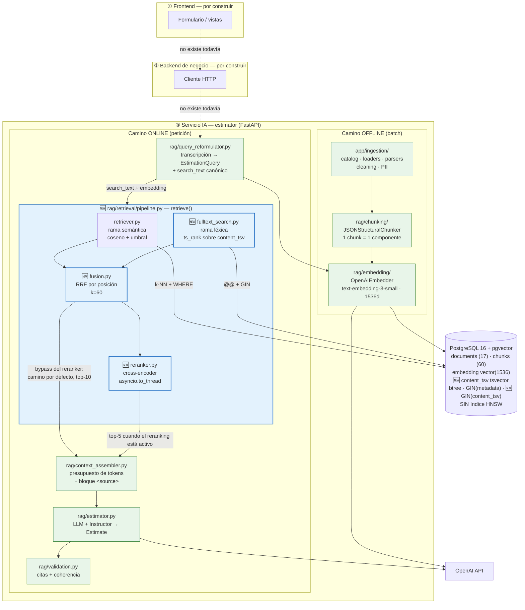

# Diagnóstico arquitectónico — Sesión 10 (cierre)

Estado del servicio IA `estimator` al cierre de la Sesión 10, con los números medidos, lo que esos
números revelaron y lo que queda pendiente. Sustituye al diagnóstico de la Sesión 09, cuyo trace
manual y cuya propuesta de evolución ya están implementados.

> **Cómo está escrito este documento.** Las observaciones van en español; los comandos, nombres de
> fichero y de campo van en inglés, igual que el código. Todas las cifras son medidas, no estimadas,
> y se pueden reproducir con los comandos de la sección 5.

---

## 1. Diagrama de la arquitectura actual

Tres capas. El servicio IA está completo de extremo a extremo: entra una transcripción cruda, sale
una estimación fundamentada y citada. Las **cajas en azul son lo que añadió la Sesión 10**; el resto
venía de sesiones anteriores y se reutiliza sin tocar.



**El interruptor doble.** `retrieve()` es la única puerta de entrada a la recuperación, y las dos
ramas del diagrama son opcionales por configuración: `RETRIEVAL_SEARCH_MODE` (`vector` | `hybrid`)
decide si la rama léxica y la fusión participan, y `RERANKER_ENABLED` decide si el cross-encoder
entra. Cada parámetro resuelve **argumento explícito → settings**, así que las cuatro
configuraciones son alcanzables por petición sin redespliegue:

| Configuración | Búsqueda | Reranking | Qué es |
|---|---|---|---|
| A | vectorial | no | la línea base de la Sesión 09 |
| B | híbrida | no | **← configuración activa por defecto** |
| C | vectorial | sí | recall-then-rerank |
| D | híbrida | sí | ambas técnicas |

---

## 2. Los números medidos

Golden set de 5 consultas anotado a mano (`estimator/scripts/golden_set.json`), corpus de 17
presupuestos / 60 chunks, `k=5`, conjunto amplio `recall_k=50`, mediana de 5 ejecuciones por
consulta, medición en caliente con precalentamiento global de las cuatro configuraciones.

| Configuración | Búsqueda | Reranking | precision@5 | recall@5 | Presupuestos distintos | Latencia |
|---|---|---|---|---|---|---|
| **A** | Vectorial | No | 0,88 | 1,00 | 2,4 / 5 | **2 ms** |
| **B** | Híbrida | No | 0,92 | 1,00 | 2,2 / 5 | **2 ms** |
| **C** | Vectorial | Sí | **0,96** | 1,00 | 2,0 / 5 | **327 ms** |
| **D** | Híbrida | Sí | 0,92 | 1,00 | 2,2 / 5 | **2.383 ms** |

Deltas contra A: `B +0,04 / +0 ms` · `C +0,08 / +325 ms` · `D +0,04 / +2.381 ms`. El embebido de la
consulta (159 ms) queda fuera de la columna porque es la misma constante en las cuatro filas.

Tres ejecuciones independientes dieron **la misma precisión**: la recuperación es determinista. Las
latencias se tomaron con la carga de la máquina por debajo de 4; con la máquina cargada por builds de
Docker, C y D se degradaban a 1.546 y 3.987 ms.

Otras cifras del sistema, medidas:

| Magnitud | Valor | Dónde importa |
|---|---|---|
| Carga del cross-encoder | ~5 s en caliente · ~20 s la primera vez | Los ~20 s incluyen la descarga de 450 MB; con el volumen `hf_cache` poblado son ~5 s. Singleton por worker, carga perezosa: la primera petición la paga |
| Inferencia del cross-encoder | 13–88 ms por par | **No escala con el número de pares** sino con los tokens totales del lote: el relleno hasta el documento más largo domina. Medido: una consulta de 15 pares costó 1.138 ms y otra de 22 pares, 319 ms |
| Pesos del modelo | ~450 MB | Volumen `hf_cache`; sin él se re-descargan en cada recreación |
| Imagen del contenedor | 1,4 GB → 6,6 GB | El precio de `sentence-transformers` (arrastra torch) |
| Candidatos reales de la rama vectorial | 9–22, nunca 50 | El `distance_threshold` limita antes que `recall_k` |
| Candidatos de la rama léxica | 17–36 de 60 | Sin piso de relevancia: casa con casi todo el corpus (ver §3.5) |
| Candidatos tras fusión (híbrida) | 21–44 | La fusión ensancha lo que paga el reranker. En Q4 y Q5 el pool **iguala** a la rama léxica: la vectorial es un subconjunto estricto de ella |

---

## 3. Diagnóstico: qué revelaron los números

### 3.1 Cuatro de los cinco fallos de la Sesión 09 están cerrados

El diagnóstico anterior identificó cinco fallos. Estado hoy:

| Fallo (S09) | Estado | Pieza que lo cierra |
|---|---|---|
| 1 — La transcripción se usa como query | **Cerrado** | `query_reformulator.py` |
| 2 — Desajuste de idioma y registro | **Cerrado** | `compose_search_text()` emite inglés canónico |
| 3 — Recuperación sin filtrado por metadata | **Cerrado** | `_structural_filters()` (sector / año / tipo) |
| 4 — No existe etapa de generación | **Cerrado** | `estimator.py` + `validation.py` |
| 5 — El chunk pierde el rollup del presupuesto | **Parcial** | `budget_id` viaja en el chunk, pero los totales del presupuesto padre no se adjuntan |

### 3.2 El cuello de botella no está donde el reranking ayuda

`recall@5` sale **1,00 en las cuatro configuraciones**: todos los presupuestos relevantes ya entran
en el top-5 sin hacer nada. La señal del artículo para saber que el reranking es la herramienta
correcta es precisa — *"los documentos relevantes están entre los candidatos, pero no arriba"* — y
aquí ya están arriba. Partimos de 0,88, no de 0,48.

Consecuencia arquitectónica: el reranking está **construido y apagado**. Encenderlo cuando aparezca
la evidencia es cambiar un booleano, y la evidencia que lo justificaría es observable: `recall@k`
alto con `precision@k` bajo de forma recurrente.

### 3.3 Las ganancias son atribuibles, y las medias las esconden

- **Q4 es el fallo que da nombre a la sesión, y lo desactiva el reranker.** Con A, el quinto puesto
  lo ocupaba `BUD-2024-014` — almacén con AGV: sector industrial, 620 h, vocabulario de operaciones
  compartido, y **logística en vez de telemetría**. C y D lo sustituyen por un chunk relevante de
  `BUD-2024-015`. La híbrida sola no lo arregla: cambia un distractor por otro.
- **Q1 la arregla la híbrida**, sacando `BUD-2024-008` (devoluciones de moda) del top-5.
- **Q3 se queda en 0,80 en las cuatro porque es el techo**, no un fallo: un único presupuesto
  relevante con 4 componentes.

### 3.4 Acumular técnicas empeora el resultado

D es la única regresión del experimento y es la configuración más cara. Puso `BUD-2024-016`
—descomposición de un core bancario monolítico— en **primera** posición para la transcripción
desordenada de e-commerce. El mecanismo es identificable: la fusión ensancha el pool de 27 a 44
candidatos, mete presupuestos que el umbral vectorial había descartado, y el cross-encoder se
equivoca puntuando uno de ellos contra una consulta verbosa y multitema. **Más candidatos no es
mejor si el reranker tiene que ordenar más ruido.**

### 3.5 La rama léxica no tiene piso de relevancia, y eso desactivaba el soft-fail

Hallazgo de la revisión posterior al cierre, corregido. La rama vectorial tiene un piso
(`distance_threshold = 0,6`); la léxica no tenía ninguno: solo exige `content_tsv @@ tsquery`. Y con
semántica OR eso casa con casi todo el corpus, por dos motivos que se suman:

- **La plantilla del chunk.** Cada chunk empieza por `[Project: …] [Client sector: … | Year: … | Main
  tech: …]`, así que `client`, `main`, `sector` y `project` están en **60 de 60 chunks**. Una consulta
  que contenga cualquiera de esas palabras recupera el corpus entero.
- **Las stopwords españolas sobreviven al analizador inglés.** `to_tsvector('english', …)` no filtra
  `de`, `y`, `para` ni `con`, y la entrada real del sistema son transcripciones en español. Medido: la
  consulta *"Cocina italiana receta de pasta carbonara…"* recuperaba un presupuesto de anonimización
  de ensayos clínicos, casando por el lexema `de`.

La consecuencia era grave y silenciosa. `low_confidence` se derivaba de que la lista estuviese vacía,
así que en modo híbrido —el default— **nunca podía valer `True`**, y la salvaguarda de la Sesión 09
en `estimator.py` dejaba de dispararse:

| Config | Transcripción administrativa real (sin proyecto comparable) |
|---|---|
| A vectorial | 0 chunks, `low_confidence=True` → devuelve "contexto insuficiente" sin pagar generación |
| B híbrida (antes) | 10 chunks de plantilla, `low_confidence=False` → **fundamenta una estimación en ruido** |

**Arreglo aplicado:** `low_confidence` significa ahora *"nada cruzó el piso semántico"* —
`not chunks or all(chunk.distance is None for chunk in chunks)`— en `hybrid_search` y en `pipeline`.
Verificado en vivo: las consultas fuera de dominio vuelven a dar `low_confidence=True` aunque traigan
chunks, y las cinco del golden set no cambian.

**Lo que se descartó y por qué:** un piso global de `ts_rank`. Se midió la distribución y **las curvas
se solapan** — la consulta de ruido tiene mediana *más alta* (0,00675) que la buena (0,00468) y
máximos casi iguales (0,02342 vs 0,02572). No hay umbral que las separe, porque `ts_rank` no pondera
por IDF: el término que aparece en 19 de 60 chunks puntúa exactamente igual que el que aparece en 0.
Es la advertencia del artículo (*"`ts_rank` no es BM25"*) materializándose.

**Coste honesto del arreglo:** un rescate literal genuino (el caso "Stripe") hace soft-fail cuando es
el *único* acierto. En este corpus no cuesta nada — no hay ni un chunk que contenga `stripe` — pero en
un corpus donde los identificadores sí aparezcan, la respuesta correcta sería un piso calibrado para
la rama léxica, o excluir la plantilla del texto indexado.

### 3.6 Deuda técnica identificada (no bloqueante)

- **No hay índice HNSW.** La migración `0002` lo dice explícitamente: el seq scan es la línea base
  contra la que la sesión en vivo de S08 mide. Con 60 chunks es irrelevante (2 ms), pero la rama
  vectorial no está indexada, así que la latencia de A y B **no extrapola** a un corpus real.
- **El `distance_threshold` de 0,6 limita el recall antes que `recall_k`.** El "conjunto amplio" del
  patrón recall-then-rerank no es tan amplio como dice la configuración, lo que abarata
  artificialmente a C. En un corpus mayor habría que revisar cuál de los dos manda.
- **El rollup del presupuesto padre sigue sin adjuntarse** al contexto (fallo 5 de S09, parcial).
- **`pytest` se instala ad-hoc en el contenedor** porque la imagen se construye con `--no-dev`.

---

## 4. Lo que queda: el orden canónico del pipeline

Las tres piezas restantes de la sesión (expansión y descomposición de consultas, routing
multi-índice, filtrado contextual y temporal) se ensamblan en la sesión en vivo. El principio que
ordena todas ellas:

> **Lo barato y excluyente, al principio; lo caro y fino, al final; lo blando, al cierre.**

| Orden | Etapa | Estado |
|---|---|---|
| 1 | Reformulación y routing | Reformulación **hecha**; routing pendiente |
| 2 | Filtros duros, empotrados en la consulta | **Hecho** (`_structural_filters`) |
| 3 | Búsqueda (semántica + léxica) y fusión | **Hecho** |
| 4 | Reranking, solo sobre los supervivientes | **Hecho**, apagado por configuración |
| 5 | Ponderaciones blandas (temporal, contextual) | Pendiente |

La asimetría a respetar cuando entren las piezas nuevas: los **filtros duros lo más temprano
posible**, las **ponderaciones blandas lo más tarde posible**. Invertirlo produce los dos clásicos
del pipeline mal montado — rerankear documentos que un filtro iba a tirar (dinero quemado), y
ponderar tan pronto que el ajuste blando expulsa candidatos antes de que el reranker pudiera
valorarlos (información destruida).

---

## 5. Reproducir el diagnóstico

```bash
cd estimator
docker compose up -d

# Gate: ¿carga y puntúa el cross-encoder?
docker compose exec estimator python -m app.generation.rag.retrieval.verify_reranker

# Corpus (idempotente: los ya ingeridos responden 409 y se saltan)
docker compose exec estimator python scripts/query_examples.py

# Las cuatro configuraciones contra el golden set
docker compose exec estimator python scripts/measure_retrieval.py

# Suite completa
docker compose exec estimator sh -c 'python -m pip install --quiet pytest pytest-asyncio fakeredis httpx'
docker compose exec estimator python -m pytest tests/ -q     # 343 passed
```

Una configuración concreta por petición, sin reiniciar nada:

```bash
http POST :8000/v1/retrieval/search X-API-Key:$RETRIEVAL_API_KEY \
  query_text="e-commerce platform with product catalog and checkout" \
  search_mode=hybrid rerank:=true
```

El razonamiento completo de la decisión y las limitaciones declaradas de la medición están en la
sección **"Sesión 10 — Búsqueda híbrida y reranking"** de `estimator/README.md`.
